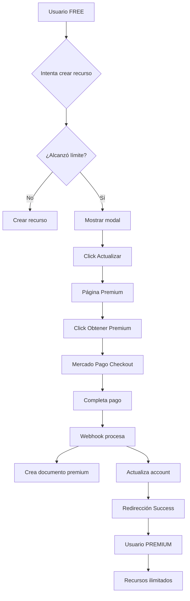

# 💳 Sistema de Suscripción Premium con Mercado Pago

## 🎯 ¿Qué hace este sistema?

Este sistema permite a los usuarios de GECO actualizar de un plan **FREE** (con límites) a un plan **PREMIUM** (ilimitado) mediante pagos con Mercado Pago.

### Características principales:

✅ **Integración completa con Mercado Pago**
- Pagos seguros con tarjeta de crédito/débito
- Webhooks para procesar pagos automáticamente
- Soporta modo testing y producción

✅ **Gestión de planes FREE vs PREMIUM**
- FREE: 5 estrategias, 10 publicidades, 50 contactos, 3 grupos
- PREMIUM: ∞ ilimitado en todo

✅ **Verificación automática de límites**
- Modales informativos cuando se alcanza un límite
- Redirección fácil a upgrade premium

✅ **Vencimiento automático**
- Cron job diario que verifica suscripciones vencidas
- Downgrades automáticos a FREE

---

## 📁 Estructura de Archivos

```
GECO/
├── functions/
│   └── src/
│       ├── config/
│       │   └── mercadopago.config.ts       # Configuración de Mercado Pago
│       ├── mercadopago/
│       │   ├── createPreference.ts         # Crear preferencia de pago
│       │   └── webhook.ts                  # Procesar notificaciones
│       ├── cron/
│       │   └── checkPremiumExpiration.ts   # Verificar vencimientos
│       └── index.ts                        # Export de functions
│
├── src/
│   ├── interfaces/dtos/external/
│   │   └── IPremium.ts                     # Interfaces TypeScript
│   ├── services/external/
│   │   ├── premiumService.tsx              # Crear pagos
│   │   └── accountService.tsx              # Verificar límites
│   ├── pages/user/
│   │   ├── GPremiumPage.tsx                # Página principal
│   │   ├── GPremiumSuccessPage.tsx         # Pago exitoso
│   │   ├── GPremiumFailurePage.tsx         # Pago fallido
│   │   └── GPremiumPendingPage.tsx         # Pago pendiente
│   ├── components/
│   │   └── GPremiumLimitModal.tsx          # Modal de límite
│   ├── hooks/
│   │   └── usePremiumLimit.tsx             # Hook de límites
│   └── styles/
│       ├── gpremium.css
│       ├── gpremium-result.css
│       └── gpremium-limit-modal.css
│
├── MERCADOPAGO_INTEGRATION.md              # 📘 Guía de integración
├── EJEMPLO_USO_PREMIUM.md                  # 💡 Ejemplos de código
├── PREMIUM_SUMMARY.md                      # 📊 Resumen completo
├── FIRESTORE_PREMIUM_RULES.md              # 🔒 Reglas de seguridad
└── README_PREMIUM.md                       # 📖 Este archivo
```

---

## 🚀 Quick Start (5 minutos)

### 1. Configurar Credenciales

```bash
# Obtén tu Access Token de Mercado Pago
# https://www.mercadopago.com.ar/developers/panel/credentials

firebase functions:config:set mercadopago.access_token="TU_ACCESS_TOKEN"
firebase functions:config:set app.url="https://geco-bf931.web.app"
```

### 2. Desplegar Functions

```bash
cd functions
npm install mercadopago  # Ya está instalado
npm run build
firebase deploy --only functions
```

### 3. Configurar Webhook

1. Ir a: https://www.mercadopago.com.ar/developers/panel/notifications/webhooks
2. URL: `https://us-central1-geco-bf931.cloudfunctions.net/mercadoPagoWebhook`
3. Eventos: ✅ Pagos

### 4. Agregar Rutas (Ver `MERCADOPAGO_INTEGRATION.md` paso 4)

### 5. ¡Listo! 🎉

---

## 📚 Documentación Completa

### Para Implementadores

1. **[MERCADOPAGO_INTEGRATION.md](./MERCADOPAGO_INTEGRATION.md)**
   - Guía paso a paso de toda la integración
   - Configuración de credenciales
   - Testing con tarjetas de prueba
   - Troubleshooting

2. **[EJEMPLO_USO_PREMIUM.md](./EJEMPLO_USO_PREMIUM.md)**
   - Ejemplos reales de código
   - Cómo integrar en estrategias
   - Cómo integrar en publicidades
   - Cómo integrar en contactos/grupos
   - Badge premium en perfil

3. **[PREMIUM_SUMMARY.md](./PREMIUM_SUMMARY.md)**
   - Resumen de todos los archivos creados
   - Checklist de implementación
   - Comandos útiles
   - Estructura de datos en Firestore

4. **[FIRESTORE_PREMIUM_RULES.md](./FIRESTORE_PREMIUM_RULES.md)**
   - Reglas de seguridad de Firestore
   - Explicación de limitaciones
   - Enfoque recomendado

---

## 🎮 Ejemplo de Uso

### En tu componente de Estrategia:

```typescript
import { usePremiumLimit } from '../../../hooks/usePremiumLimit';
import { GPremiumLimitModal } from '../../../components/GPremiumLimitModal';

export const GStrategyResumePage = () => {
  const { isLimitModalOpen, limitInfo, canCreateStrategy, closeLimitModal } = usePremiumLimit();

  const handleSubmit = async () => {
    // Obtener conteo actual
    const currentCount = await getMyStrategiesCount();
    
    // Verificar límite
    const canCreate = await canCreateStrategy(currentCount);
    
    if (!canCreate) {
      return; // Modal se abre automáticamente
    }
    
    // Crear estrategia...
  };

  return (
    <div>
      {/* Tu formulario */}
      
      {/* Modal automático */}
      {isLimitModalOpen && limitInfo && (
        <GPremiumLimitModal
          isOpen={isLimitModalOpen}
          onClose={closeLimitModal}
          feature={limitInfo.feature}
          currentCount={limitInfo.currentCount}
          limit={limitInfo.limit}
        />
      )}
    </div>
  );
};
```

---

## 💰 Precios y Límites

### Plan FREE (Gratis)
- ✅ 5 estrategias
- ✅ 10 publicidades
- ✅ 50 contactos
- ✅ 3 grupos

### Plan PREMIUM ($1500/mes)
- ✨ ∞ Estrategias ilimitadas
- ✨ ∞ Publicidades ilimitadas
- ✨ ∞ Contactos ilimitados
- ✨ ∞ Grupos ilimitados

### Personalizar

Edita en `src/interfaces/dtos/external/IPremium.ts`:

```typescript
export const PREMIUM_PRICE = 1500; // Cambiar precio

export const FREE_LIMITS: IPremiumLimits = {
  strategies: 5,   // Cambiar límite
  images: 10,
  contacts: 50,
  groups: 3
};
```

---

## 🔄 Flujo Completo



---

## 🧪 Testing

### Tarjetas de Prueba

**APROBADA:**
- Número: `5031 7557 3453 0604`
- CVV: `123`
- Fecha: Cualquier futura

**RECHAZADA:**
- Número: `5031 4332 1540 6351`
- CVV: `123`
- Fecha: Cualquier futura

### Testing Completo

1. Crear usuario FREE
2. Intentar crear 6ta estrategia → Modal
3. Actualizar a premium → Mercado Pago
4. Pagar con tarjeta de prueba
5. Verificar cuenta premium en Firestore
6. Crear más estrategias → Sin límite

---

## 🛠️ Comandos Útiles

```bash
# Ver configuración
firebase functions:config:get

# Ver logs
firebase functions:log

# Verificar vencimientos manualmente
curl https://us-central1-geco-bf931.cloudfunctions.net/checkPremiumExpirationManual

# Redesplegar
firebase deploy --only functions
```

---

## 📊 Base de Datos

### Colección: `accounts`
```json
{
  "accountType": "premium",
  "accountPrice": 1500,
  "premiumId": "ref-to-premium",
  "userId": "firebase-uid"
}
```

### Colección: `premium`
```json
{
  "userId": "firebase-uid",
  "startDate": "2025-01-01",
  "endDate": "2025-01-31",
  "status": "active",
  "price": 1500
}
```

---

## 🔐 Seguridad

- ✅ Firebase Auth requerido
- ✅ Verificación de userId en todas las operaciones
- ✅ Webhook valida origen de Mercado Pago
- ✅ Functions con permisos de admin
- ✅ Reglas de Firestore protegen documentos

---

## 🌟 Próximos Pasos

1. [ ] Configurar credenciales de Mercado Pago
2. [ ] Desplegar functions
3. [ ] Configurar webhook
4. [ ] Agregar rutas en frontend
5. [ ] Integrar verificación de límites
6. [ ] Testing completo
7. [ ] 🚀 **¡Lanzar a producción!**

---

## 📞 Soporte

- 📘 **Guía completa:** `MERCADOPAGO_INTEGRATION.md`
- 💡 **Ejemplos:** `EJEMPLO_USO_PREMIUM.md`
- 📊 **Resumen:** `PREMIUM_SUMMARY.md`
- 🔒 **Seguridad:** `FIRESTORE_PREMIUM_RULES.md`

---

## ✨ Features Implementadas

- [x] Integración con Mercado Pago
- [x] Gestión de planes FREE/PREMIUM
- [x] Verificación de límites
- [x] Modal de upgrade
- [x] Páginas de resultado (success/failure/pending)
- [x] Webhook automático
- [x] Verificación de vencimientos (cron)
- [x] Hook personalizado (usePremiumLimit)
- [x] Servicio de cuentas (AccountService)
- [x] Documentación completa
- [x] Ejemplos de código
- [x] Estilos modernos

---

## 🎉 ¡Felicitaciones!

Tienes un sistema completo de suscripción premium listo para usar.

**Tiempo de implementación:** 1-2 horas  
**Complejidad:** Media  
**Resultado:** Sistema profesional de pagos 💳✨

---

**¿Preguntas?** Revisa la documentación completa en los archivos `.md` 📚
